# 二开能力专项

>*说明：sie-test-app以物料库存管理为例,解释dto能力可兼容历史代码和二开、三开新的代码结构。  
>依赖最小引擎版本：v2.3.5_01.xingsen-SNAPSHOT，最小SDK版本：v2.3.5_01.xingsen-SNAPSHOT  
>示例代码：com.sie.iidp.example.mixmodel.model.MaterialInventory   
>sie-test-app：是以非dto方式开发的模型示例，用于模仿现有开发方式；  
>sie-test-appB：是以dto方式开发，扩展sie-test-app物料库存模型；  
>sie-test-appC：是以dto方式开发，继承sie-test-appB物料库存模型*

### sie-test-app以物料库存管理为例
- 重写基类CRU方法（非dto方式），省略业务处理逻辑；
- 提供“工艺流程”复杂业务逻辑处理接口（业务逻辑仅用输出日志代替）
- 工艺流程步骤图示：  
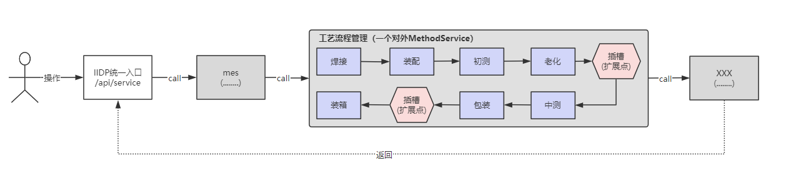
- demo工程示例代码：  
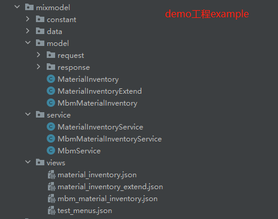

### 二开能力提供以下能力
1. 代码分层结构：图示，新增request、response、service、doc等层级资源路径   
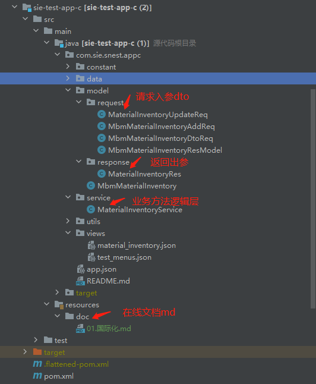
2. 强类型入参dto封装，必须继承RequestModel基类，不建议设置model.type，SDK已做特殊解析。  
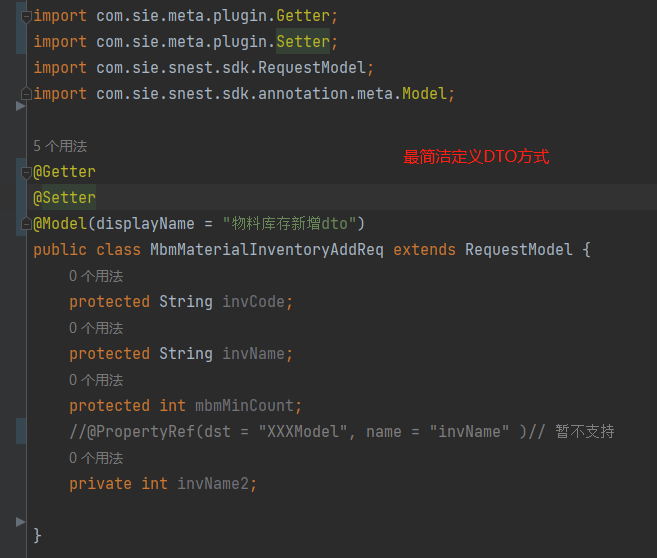
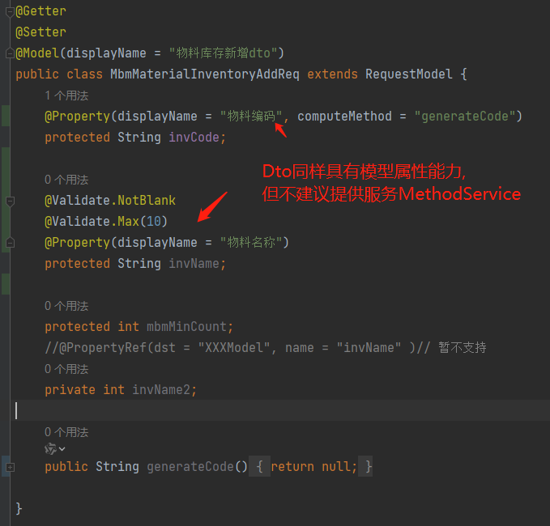
3. 强类型出参封装，必须继承ResponseModel基类，不建议设置model.type，SDK已做特殊解析。  
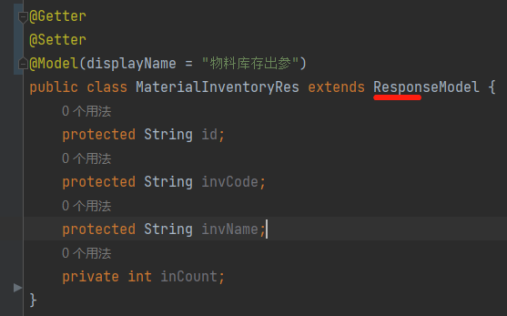
4. 强类型(入参/出参)扩展  
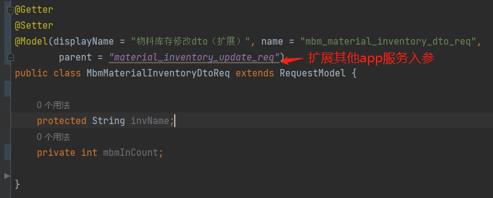
5. 业务逻辑分层service：将自身复杂业务代码抽离到service层，这样可减轻model逻辑堆叠压力，提高可读性。  
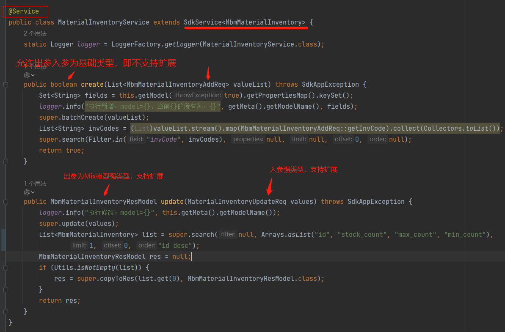
6. 模型层model改变：1）声明服务不生成api接口文档；2)注入Service；3）服务入参出参可定义为强类型；4）单个服务声明不生成api接口文档；5）增加服务指定说明文档(文档地址可以是相对路径或http地址)。  
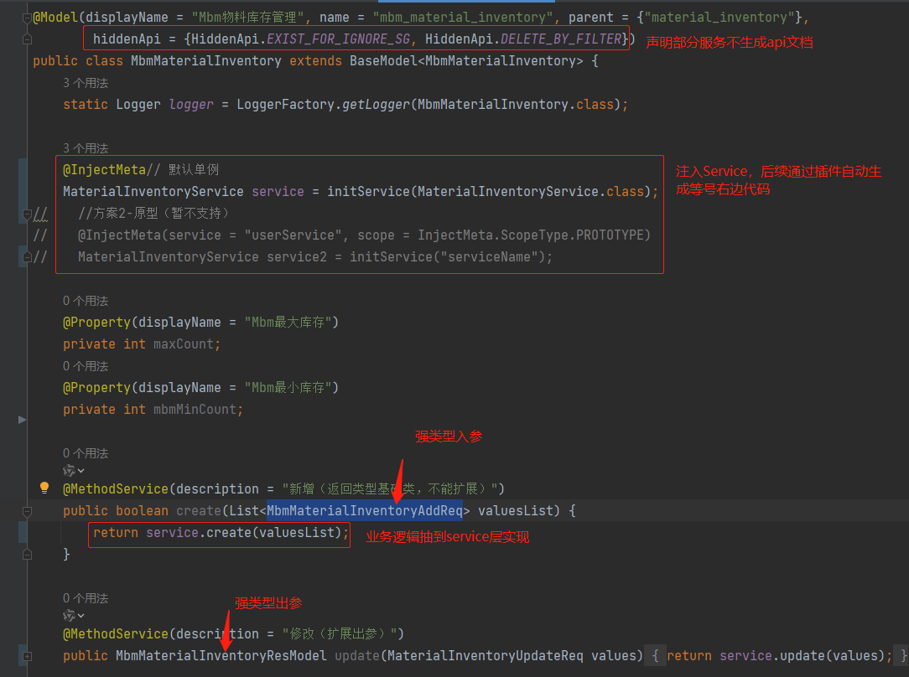
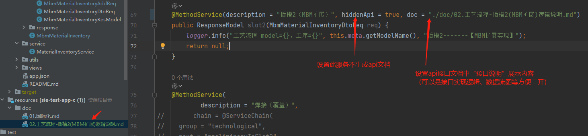  
7. SdkService提供常用工具方法，减轻业务处理；同时，支持业务自身封装自己的行业Service基类。  
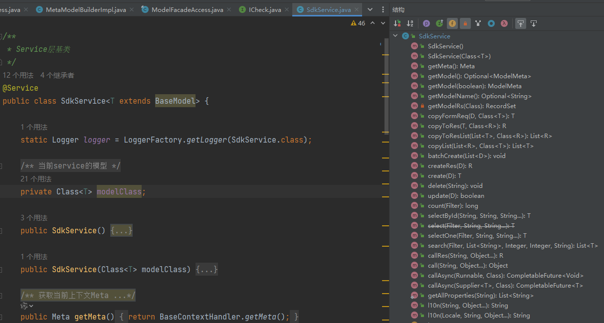
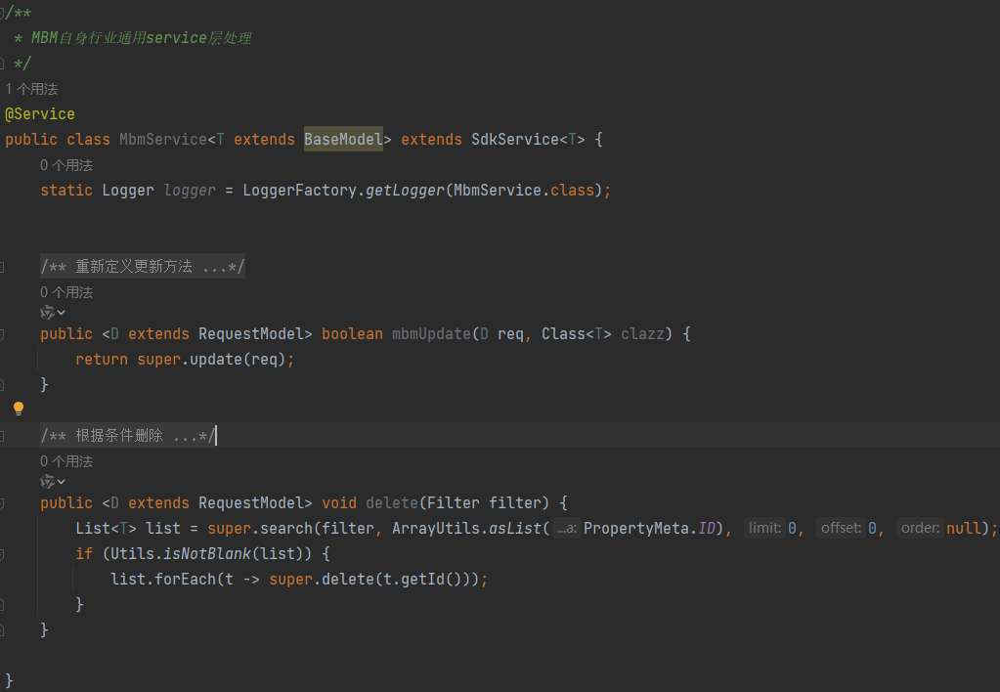