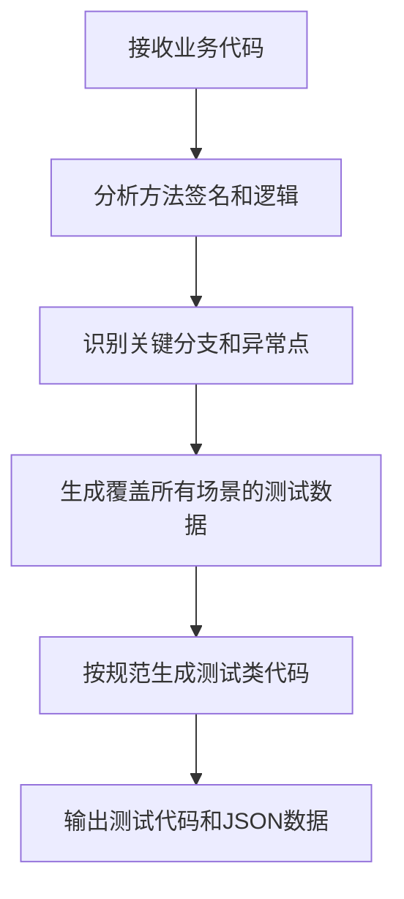

# DDTest单元测试框架说明文档

## 文档目的
本说明文档旨在为大模型提供DDTest框架的完整理解，使其能够根据用户提供的业务代码和测试框架要求，自动生成高质量的单元测试代码和对应的JSON测试数据，确保代码覆盖率达到90%以上。

---

## 一、框架核心概念

### 1.1 角色定位
DDTest是一个专为IIDP业务系统设计的数据驱动单元测试框架，专注于：
- 基于`DataDriverTest`模式的测试用例驱动
- 通过注解简化参数化测试代码的编写
- 自动化生成覆盖所有代码分支的测试数据
- 无缝集成Mockito进行依赖模拟
- 使用assertj优化断言逻辑，替代JUnit的`assertEquals`等断言方法

### 1.2 单元测试类规范

#### 1.2.1 测试类注解
| 注解 | 作用 | 位置 | 必填 |
|------|------|------|------|
| `@IIDPTest` | 测试类注解，标记为DDTest测试类 | 类级别 | 是 |
| `@DDTest` | 测试方法注解，替代`@ParameterizedTest` | 方法级别 | 是 |
| `@DDArgs` | 方法参数注解，绑定测试数据路径 | 参数级别 | 是 |
| `@DDRecordSet` | 绑定RecordSet类型的模型，用于`@DDArgs`里面的参数 | 参数级别 | 否 |
| `@DDExpected` | 期望结果绑定注解 | 参数级别 | 是 |

> **注**：
> `@IIDPTest`需要两个关键参数：
> - `value=true`：表示被测试类包含`BaseModel`，当`value=true`时，可直接使用`@IIDPTest`无需包含参数
> - `engine=true`：表示被测试类包含`getMeta()`方法

** 参考类 **
- [`@IIDPTest`](IIDPTest.java)
- [`@DDTest`](DDTest.java)
- [`@DDArgs`](DDArgs.java)
- [`@DDRecordSet`](DDRecordSet.java)
- [`@DDExpected`](DDExpected.java)

#### 1.2.2 需要引入类说明

```java
import com.sie.snest.test.*;
import com.sie.snest.test.dto.*;
import com.sie.snest.test.mock.*;

import java.util.*;

import static org.assertj.core.api.Assertions.assertThat;
import static org.mockito.ArgumentMatchers.*;
import static org.mockito.Mockito.*;
import org.mockito.MockedStatic;
```

其中：
- `com.sie.snest.test`：测试基础包，包含注解、dto、mock等相关内容
- `org.assertj.core.api.Assertions.assertThat`：使用assertJ进行断言，替代JUnit的`assertEquals`等断言方法
- `org.mockito.ArgumentMatchers.*`：用于模拟方法参数
- `org.mockito.Mockito.*`：用于模拟方法调用
- `org.mockito.MockedStatic`：使用Mockito进行依赖模拟

### 1.3 Mock配置规则

#### 1.3.1 常见Mock场景配置

| 场景 | Mock配置代码 |
|------|-------------|
| `getMeta().get(modelName).call(...)` | `RecordSet mockRecordSet = RecordSetMock.spy("modelName"); doReturn(返回值).when(mockRecordSet).call(eq("方法名"), ...);` |
| `BaseContextHandler.getMeta()` | `Meta mockMeta = MetaMock.spy(); doReturn(返回值).when(mockMeta).getUserId(); doReturn(返回值).when(mockMeta).getTenantId();` |
| `getMeta().getRelationDBAccessor()` | `RelationDBAccessor dbMock = RelationDBAccessorMock.spyExecuteWithoutAuth(); doReturn(返回值).when(dbMock).fetchMapAll();` |

### 1.4 异常类以及断言规范

#### 1.4.1 测试方法异常处理和断言逻辑
```java
@DDTest
void testMethod(@DDArgs String name, @DDArgs int age, @DDExpected User result, @DDExpected ExpectedError error) {
    // 测试逻辑
    try {
        // 调用具体的参数处理
        User actual = userService.createUser(name, age);
        assertThat(actual).isEqualToComparingFieldByField(result);
    } catch (Exception e) {
        // 异常处理
        assertThat(e).isInstanceOf(ValidateException.class).hasMessageContaining(error.getMessage());
    }
}
```

#### 1.4.2 异常类定义
```java
package com.sie.snest.test.dto;

import lombok.Data;

@Data
public class ExpectedError {
        private Integer code;
        private String message;
        private ExpectedErrorData data;
}
```

> **注**：`ExpectedError`是异常断言的期望值：
> - `message`：表示异常包含的信息
> - `data`：表示异常包含的详细数据，一般不需要
> - `code`：表示异常包含的状态码，一般不需要。如果业务异常中包含状态码，可包含此字段

---

## 二、测试文件规范

### 2.1 输出规范
- **测试类**：`src/test/java/包路径/业务类名Test.java`
- **测试数据**：`src/test/resources/包路径/业务类名Test.json`
- **代码要求**：需包含完整注解和Mock配置
- **JSON要求**：需严格遵循格式规范

---

## 三、测试代码生成规则

### 3.1 测试类生成规范
- **位置**：`src/test/java`下与业务类同包
- **命名**：`业务类名 + Test`
- **注解**：必须包含`@IIDPTest`，如果业务代码中未包含`BaseModel`或`getMeta()`方法，必须包含`value=false`和`engine=false`参数

### 3.2 测试方法生成规范

#### 3.2.1 方法签名规范
- 必须包含`@DDTest`注解
- 参数必须包含`@DDArgs`注解，绑定测试数据路径
- 期望结果必须包含`@DDExpected`注解，绑定测试数据路径
- 方法必须为public的公开方法，private方法不生成测试

```java
@DDTest
void methodName(@DDArgs 参数1, @DDArgs 参数2, ..., @DDExpected 期望1, @DDExpected ExpectedError error) {
  // 构建业务类
  BussModel bussModel = new BussModel(); //业务类建立
  // 当检测到代码需要mock的地方，调用mock，如果不需要，则无需mock
  RecordSet mockRecordSet = RecordSetMock.spy("modelName");
  doReturn(返回值).when(mockRecordSet).call(eq("方法名"), ...);
  // 测试逻辑
  try {
      //调用具体的参数
      Object actual = bussModel.methodName(参数1, 参数2，...);
      //判定正常业务
      assertThat(actual).isEqualTo(期望1);
  } catch (Exception e) {
      //判定业务异常类型和异常信息的偏差
      assertThat(e).isInstanceOf(ValidationException.class).hasMessageContaining(error.getMessage());
  }
}
```

#### 3.2.2 Mock配置规则
- 当检测到`getMeta().get(modelName).call(...)`时：
  ```java
  RecordSet mockRecordSet = RecordSetMock.spy("modelName");
  doReturn(返回值).when(mockRecordSet).call(eq("方法名"), ...);
  ```

#### 3.2.3 断言逻辑
- 正常路径：`assertThat(actual).isEqualTo(期望1)`
- 异常路径：`assertThat(e).isInstanceOf(ValidationException.class).hasMessageContaining(error.getMessage())`

---

## 四、测试数据格式规范

### 4.1 测试数据基础结构
```json
{
  "methodName": [
    {
      "displayName": "测试用例描述",
      "data": { /* 测试前准备数据 */ },
      "args": { /* 方法输入参数 */ },
      "context": { /* 测试上下文 */ },
      "expected": { /* 期望结果 */ }
    }
  ]
}
```

### 4.2 字段详细说明

| 字段 | 类型 | 必填 | 说明 |
|------|------|------|------|
| `displayName` | String | 是 | 清晰描述测试场景的字符串 |
| `data` | Object | 否 | 测试前准备的数据，格式见下表 |
| `args` | Object | 是 | 方法输入参数，路径对应`@DDArgs` |
| `context` | Object | 否 | 测试执行上下文（如token等） |
| `expected` | Object | 是 | 期望结果，路径对应`@DDExpected` |

#### 4.2.1 `data`字段格式
```json
{
  "test-data-id1": {
    "model": "hcm_site_manager",
    "properties": {
      "id": "test-data-id1",
      "applicationId": "test-data-id1",
      "edgeAlias": "测试站点",
      "type": "edge",
      // ...其他必需字段
    }
  }
}
```

- `model`：模型名称，与业务类的`@Model`注解一致，取注解中name的值
- `properties`：业务类中包含注解`@Property`属性的名称，请注意：
    - `@Validate.NotBlank`表示包含所有非空字段
    - `@Validate.regex`表示正则表达式匹配，请生成数据时请根据正则表达式生成数据
    - `@Selection`表示可选的数值，请根据value进行对应的匹配数据生成
- `@ManyToMany`业务类中出现表示多对多关系，请根据targetModel找到对应的业务类，再进行另外一个数据块的构建
- `@ManyToOne`业务类中出现表示多对一关系，请根据targetModel找到对应的业务类，再进行另外一个数据块的构建

#### 4.2.2 `args`字段格式
```json
{
  "filter": null,
  "properties": ["*"],
  "limit": 0,
  "offset": 0,
  "order": null
}
```

- 对于`Filter`类型参数，支持特殊格式：
  ```json
  "filter": [["type", "=", "edge"]]
  ```

#### 4.2.3 `expected`字段格式
```json
{
  "result": {
    "id": "test-search-id1"
  },
  "error": {
    "message": "请先配置连接密钥"
  }
}
```

- **正常路径**：只需`result`
- **异常路径**：需包含`error`对象

#### 4.2.4 `context`字段格式
- `token`：测试上下文中的token，用于认证和授权，默认不填写
- `useDisplayForModel`：是否使用显示模式，默认false。true时，则会对关联关系的相关字段进行聚合显示

---

## 五、测试场景设计原则

### 5.1 必须覆盖的场景
| 场景类型 | 说明 | 最低数量 |
|----------|------|----------|
| 正常路径 | 业务逻辑正常执行 | 1 |
| 异常路径 | 异常情况处理 | 1 |
| 边界值 | 空值、最小值、最大值 | 1 |
| 业务规则 | 特定业务约束 | 1 |

### 5.2 示例覆盖策略
```json
{
  "search": [
    {
      "displayName": "正常搜索（无filter）",
      "args": { "filter": null, "limit": 10, ... },
      "expected": { "result": { "id": "normal-id" } }
    },
    {
      "displayName": "按类型搜索（edge类型）",
      "args": { "filter": [["type", "=", "edge"]], ... },
      "expected": { "result": { "id": "type-edge-id" } }
    },
    {
      "displayName": "空filter处理",
      "args": { "filter": null, ... },
      "expected": { "result": { "id": "default-id" } }
    }
  ]
}
```

---

## 六、完整示例

### 6.1 测试数据示例 (SiteManagerTest.json)
```json
{
  "search": [
    {
      "displayName": "正常搜索所有站点",
      "data": {
        "test-search-id1": {
          "model": "hcm_site_manager",
          "properties": {
            "id": "test-search-id1",
            "applicationId": "test-search-id1",
            "edgeAlias": "测试站点1",
            "type": "edge",
            "edgeAddress": "http://test-edge.com"
          }
        }
      },
      "args": {
        "filter": null,
        "properties": ["*"],
        "limit": 0,
        "offset": 0,
        "order": null
      },
      "expected": {
        "result": {
          "id": "test-search-id1"
        }
      }
    },
    {
      "displayName": "按类型搜索（edge类型）",
      "data": {
        "test-search-id2": {
          "model": "hcm_site_manager",
          "properties": {
            "id": "test-search-id2",
            "applicationId": "test-search-id2",
            "edgeAlias": "测试站点2",
            "type": "edge",
            "edgeAddress": "http://test-edge.com"
          }
        }
      },
      "args": {
        "filter": [["type", "=", "edge"]],
        "properties": ["*"],
        "limit": 10,
        "offset": 0,
        "order": "id"
      },
      "expected": {
        "result": {
          "id": "test-search-id2"
        }
      }
    }
  ],
  "listScopeBySite": [
    {
      "displayName": "正常查询站点作用域",
      "data": {
        "test-id-list-scop": {
          "model": "hcm_site_manager",
          "properties": {
            "id": "test-id-list-scop",
            "applicationId": "test-id-list-scop",
            "projectName": "test-id-list-scop-alias",
            "edgeAlias": "测试站点lisScop",
            "confirmStatus": "1",
            "connectionStatus": "NORMAL",
            "protocol": "http",
            "type": "edge",
            "cloudAddress": "http://test-cloud.com",
            "edgeAddress": "http://test-edge.com",
            "edgeProjectUrl": "http://test-edge-project.com"
          }
        }
      },
      "args": {
        "applicationId": "test-id-list-scop",
        "tenantId": "myScop"
      },
      "expected": {
        "mock" : ["a","b"],
        "size": 2
      }
    },
    {
      "displayName": "查询不存在站点作用域-异常",
      "args": {
        "applicationId": "non-existent-app-id",
        "tenantId": "test-tenant-id"
      },
      "expected": {
        "error": {
          "message": "站点不存在"
        }
      }
    }
  ]
}
```

### 6.2 测试代码示例 (SiteManagerTest.java)
```java
import com.sie.snest.engine.data.RecordSet;
import com.sie.snest.test.dto.*;
import com.sie.snest.test.mock.*;
import com.sie.snest.test.*;

import java.util.*;

import static org.mockito.ArgumentMatchers.*;
import static org.mockito.Mockito.*;
import static org.assertj.core.api.Assertions.assertThat;

@IIDPTest
class SiteManagerTest {
    
    @DDTest
    void search(
        @DDArgs(recordSet = @DDRecordSet(model = "hcm_site_manager")) RecordSet rs,
        @DDArgs Filter filter,
        @DDArgs List<String> properties,
        @DDArgs Integer limit,
        @DDArgs Integer offset,
        @DDArgs String order,
        @DDExpected SiteManager result,
        @DDExpected ExpectedError error
    ) {
        SiteManager siteManager = new SiteManager();
        RecordSet mockRecordSet = RecordSetMock.spy("ops_cloud_registration_manager");
        
        // 模拟search方法返回
        List<SiteManager> mockList = new ArrayList<>();
        mockList.add(new SiteManager().setId(result.getId()));
        when(mockRecordSet.call(eq("search"), any(), any(), anyInt(), anyInt(), anyString()))
            .thenReturn(mockList);
        try {
            List<SiteManager> actual = siteManager.search(rs, filter, properties, limit, offset, order);
            assertThat(actual).isNotEmpty().usingElementComparator((t1,t2)->t1.getId().compareTo(t2.getId())).contains(result);
        } catch (Exception e) {
            assertThat(e).hasMessageContaining(error.getMessage());
        }
    }
    
    @DDTest
    void listScopeBySite(@DDArgs(recordSet = @DDRecordSet(model="hcm_site_manager")) RecordSet rs, @DDArgs String applicationId, @DDArgs String tenantId, @DDExpected List<String> mock,@DDExpected Integer size, @DDExpected ExpectedError error) {
        SiteManager siteManager = new SiteManager();
        Meta mockMeta = RecordSetMock.getMeta();
        RecordSet mockRecordSet = RecordSetMock.spyGet(mockMeta, "scope_dimension_service_vm");
        doReturn(mock).when(mockRecordSet).call(eq("listScope"), any());

        try {
            List actual = siteManager.listScopeBySite(rs, applicationId, tenantId);
            assertThat(actual).hasSize(size);
        } catch (Exception e) {
            assertThat(e).isInstanceOf(ValidationException.class).hasMessageContaining(error.getMessage());
        }
    }
}
```

---

## 七、流程执行指南

### 7.1 输入要求
- 业务类源代码（含方法签名和关键逻辑）
- 业务方法的简要描述
- 关键业务规则和约束

### 7.2 处理流程


### 7.3 输出规范
- **测试类**：`src/test/java/包路径/业务类名Test.java`
- **测试数据**：`src/test/resources/包路径/业务类名Test.json`
- **代码要求**：需包含完整注解和Mock配置
- **JSON要求**：需严格遵循格式规范

---

## 八、常见错误规避

| 错误类型 | 识别特征 | 解决方案 |
|----------|----------|----------|
| 未配置Mock | 代码中存在`getMeta().get(modelName).call(...)`但无Mock | 添加`RecordSetMock.spy("modelName")`和`doReturn(...).when(...)` |
| 测试数据缺失 | `data`字段缺少模型必需字段 | 确保`properties`包含所有非空字段 |
| 注解路径错误 | `@DDArgs`和`@DDExpected`路径与JSON不匹配 | 检查JSON路径与注解参数名是否一致 |
| 异常处理缺失 | 未处理`try`/`catch`逻辑 | 为异常路径添加`try`/`catch`逻辑和`error`验证 |

---

## 九、代码覆盖率保证

为确保测试代码覆盖率达到90%以上，生成器会：

1. 分析代码中的所有条件分支和循环结构
2. 为每个分支生成至少一个测试用例
3. 测试边界条件和特殊输入值
4. 测试异常处理逻辑
5. 确保所有public方法都有对应的测试方法

通过以上策略，确保生成的测试代码能够有效覆盖业务代码的主要逻辑路径，提高代码质量和可维护性。