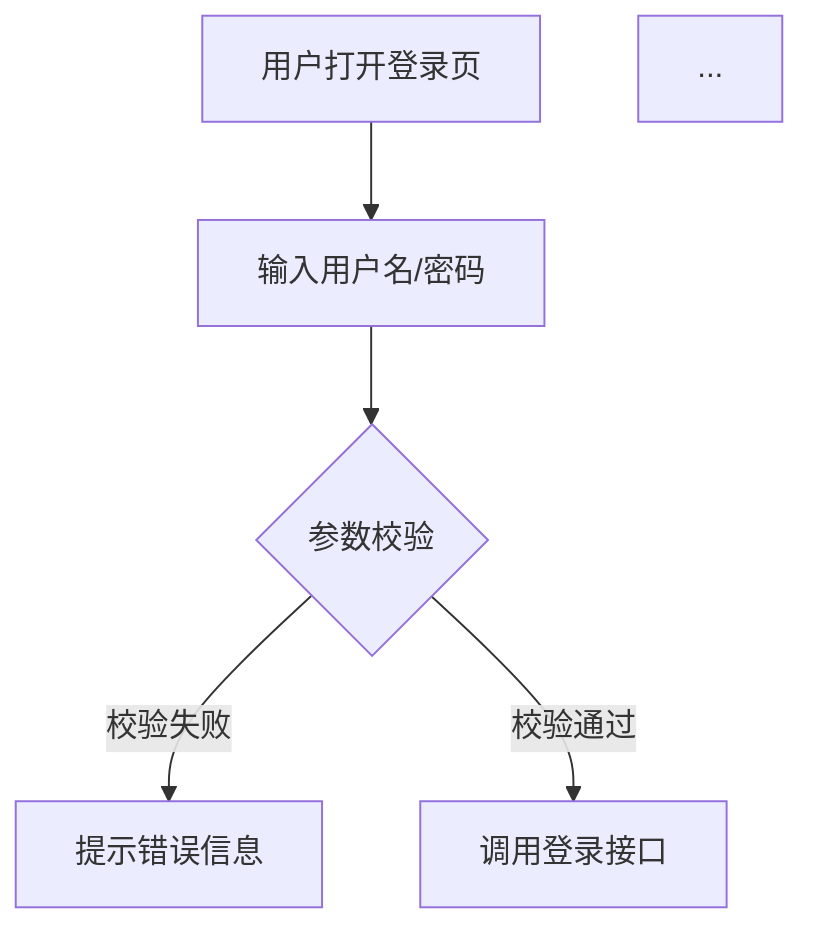
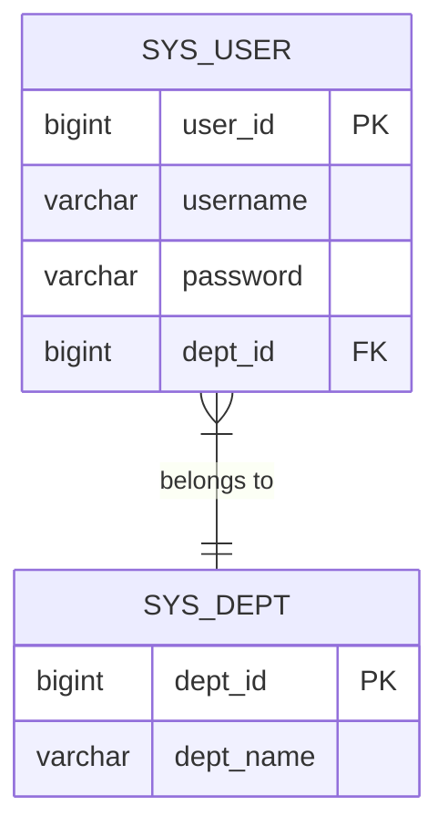

# LLM Prompt 模板 — 代码转规格书

每个模板对应一种 Spec 文档类型。  
使用时将 `{{...}}` 占位符替换为 codegraph 查询结果。

---

## 通用变量说明

```
{{PROJECT_NAME}}    项目名称
{{FRAMEWORK}}       框架名（RuoYi / JEECG Boot / yudao-cloud / maku-boot / 其他）
{{MODULES}}         模块列表（从 codegraph_search 提取）
{{CONTROLLERS}}     Controller 类列表（含方法签名）
{{ENTITIES}}        Entity 类列表（含字段）
{{SERVICES}}        Service 接口列表
{{CALL_TRACE}}      某功能的完整调用链（codegraph_trace 输出）
{{CALLERS}}         某方法的调用者列表（codegraph_callers 输出）
{{API_ANNOTATIONS}} API 注解信息（@ApiOperation / @Operation）
```

---

## Prompt 1 — 项目概览 + HLA 高阶架构

```
你是一名资深系统架构师，请根据以下代码分析结果生成项目高阶架构文档（HLA）。

## 项目基本信息
- 项目名称：{{PROJECT_NAME}}
- 技术框架：{{FRAMEWORK}}
- 主要模块：{{MODULES}}

## codegraph 提取的符号统计
{{CODEGRAPH_STATUS_OUTPUT}}
（格式：文件数 X，节点数 Y，边数 Z，语言分布）

## 识别到的顶层包结构
{{FILE_TREE}}

## 识别到的 Controller 类（API 入口）
{{CONTROLLERS}}

## 识别到的 Entity 类（数据模型）
{{ENTITIES}}

## 请生成以下内容：

1. **系统定位**（1-2 段，描述系统是什么、解决什么问题）

2. **技术架构图**（Mermaid graph TB，包含：前端/移动端 → 网关 → 各服务模块 → 数据库）

3. **模块职责表**（Markdown 表格，列：模块名 | 职责描述 | 核心类）

4. **分层架构说明**（Controller → Service → Mapper → DB，加框架特有层如 Convert/VO）

5. **非功能性特征**（安全机制、权限模型、日志审计、缓存策略——从代码注解推断）

6. **外部依赖**（从 import 分析：第三方服务、中间件、OSS 等）

输出格式：Markdown，使用中文，专业规范，不要猜测未在代码中体现的功能。
```

---

## Prompt 2 — SRS 软件需求规格

```
你是一名需求工程师，请根据以下代码分析结果，逆向生成软件需求规格说明书（SRS）。

## 系统概览
- 系统名称：{{PROJECT_NAME}}
- 框架：{{FRAMEWORK}}

## 功能入口（API Controller 列表）
{{CONTROLLERS_WITH_METHODS}}
（格式：ControllerName.methodName(params) → HTTP Method + Path）

## 操作日志覆盖的功能点
{{LOG_ANNOTATIONS}}
（格式：@Log(title="模块名", businessType=BusinessType.INSERT/UPDATE/DELETE)）

## 权限定义
{{PERMISSION_ANNOTATIONS}}
（格式：@PreAuthorize("@ss.hasPermi('system:user:edit')")）

## 请生成以下内容：

### 1. 功能需求列表（每条格式如下）

**FR-001 用户登录**
- 描述：用户通过用户名/密码登录系统，验证通过后返回 JWT Token
- 优先级：P0（核心功能）
- 相关 API：POST /system/user/login
- 前置条件：用户账号未被禁用
- 主流程：[步骤列表]
- 异常流程：账号不存在 / 密码错误 / 账号锁定

### 2. 非功能需求（从代码推断）
- 安全性需求（认证方式、权限粒度）
- 数据验证需求（@NotNull、@Length 等注解）
- 日志审计需求（@Log、@AutoLog 覆盖范围）

### 3. 约束条件
- 框架约束（如 JEECG 的 Online 低代码功能限制）
- 数据权限约束（@DataScope 规则）

输出：Markdown，按业务模块分章节，每个功能需求一个独立章节。
不要编造代码中不存在的需求，遇到不确定的地方用 [需确认] 标注。
```

---

## Prompt 3 — PRD 产品需求文档

```
你是一名产品经理，请将以下技术代码分析结果转化为面向产品和业务的 PRD 文档。

## 系统基本信息
- 产品名称：{{PROJECT_NAME}}
- 目标用户：[根据权限体系推断，如：系统管理员、普通用户、审批人]

## 功能模块（从 @Api(tags) 或包结构提取）
{{MODULES_LIST}}

## 主要业务流程（codegraph_trace 输出）
{{CALL_TRACE_RESULTS}}
（一到三个核心业务流程的调用链）

## 数据实体关系
{{ENTITY_RELATIONSHIPS}}

## 请生成以下内容：

### 1. 产品背景与目标（1页）

### 2. 用户角色与权限矩阵
| 角色 | 模块 | 可执行操作 |
（从权限注解提取角色名称和权限点）

### 3. 功能模块详述
每个模块：
- **功能概述**（1-2 句）
- **核心功能列表**（Bullet，来自 API 方法）
- **业务规则**（来自 Service 层逻辑和注解）
- **数据展示**（列表页字段、表单字段——来自 VO/Entity）

### 4. 业务流程描述（文字 + Mermaid 流程图）
针对核心业务流程（如订单创建、审批流、用户注册）

### 5. 数据字典（来自 @Dict、枚举类）

输出：面向非技术读者，避免使用代码术语，用业务语言描述。
```

---

## Prompt 4 — 用户故事

```
请根据以下 API 接口列表和操作日志注解，生成标准格式的用户故事（User Stories）。

## 接口列表
{{API_LIST}}
（格式：HTTP Method + Path + @ApiOperation/summary 描述）

## 操作日志
{{AUDIT_LOGS}}

## 角色定义
{{ROLES}}

## 请为每个主要功能生成用户故事，格式如下：

**US-001**
- 作为 [角色]
- 我希望 [功能描述]
- 以便 [业务价值]

**验收标准（Acceptance Criteria）**：
- Given [前置条件]
- When [用户操作]
- Then [系统响应]

**优先级**：P0/P1/P2
**关联 API**：POST /xxx/xxx

## 额外要求：
- 按业务模块分组
- P0 = 核心流程（登录、主业务 CRUD），P1 = 辅助功能，P2 = 配置/管理功能
- 使用中文，语言简洁清晰
```

---

## Prompt 5 — API 文档（RESTful）

```
你是一名 API 文档工程师，请根据以下代码分析结果生成 RESTful API 规格文档。

## 项目信息
- API Base URL：/api（或从配置推断）
- 认证方式：{{AUTH_METHOD}}（JWT Bearer / Sa-Token / Session）

## Controller 信息
{{CONTROLLER_DETAILS}}
（格式：ControllerName、@RequestMapping 路径、每个方法的签名 + 注解）

## DTO/VO 信息
{{DTO_DETAILS}}
（Entity/ReqVO/RespVO 字段列表，含 @ApiModelProperty/@Schema 描述）

## 请为每个 API 生成以下格式：

---
### POST /system/user/login
**描述**：用户登录，获取访问令牌

**请求头**：
| Key | Value |
|-----|-------|
| Content-Type | application/json |

**请求体**：
```json
{
  "username": "string（必填）用户名",
  "password": "string（必填）密码，MD5 加密"
}
```

**响应**：
```json
{
  "code": 200,
  "msg": "操作成功",
  "data": {
    "token": "string JWT Token",
    "tokenHead": "Bearer "
  }
}
```

**错误码**：
| 错误码 | 说明 |
|-------|------|
| 401 | 用户名或密码错误 |
| 423 | 账号已被禁用 |

**权限**：无需登录
---

输出格式：Markdown，按模块分组，每个接口用 --- 分隔。
对于不确定的字段类型，标注 [需确认]。
```

---

## Prompt 6 — 流程图生成

```
请根据以下调用链分析结果，生成业务流程的 Mermaid 流程图。

## 调用链数据（codegraph_trace 输出）
{{CALL_TRACE_JSON}}

## 业务场景名称
{{SCENARIO_NAME}}（例如：用户登录流程、订单创建流程、审批流程）

## 请生成：

### 1. 用户操作视角流程图（面向产品/业务）



### 2. 技术调用链时序图（面向开发）

```mermaid
sequenceDiagram
    actor User
    participant Controller as LoginController
    participant Service as SysLoginService  
    participant Mapper as SysUserMapper
    participant DB as MySQL
    
    User->>Controller: POST /login {username, password}
    Controller->>Service: login(username, password)
    Service->>Mapper: selectUserByUserName(username)
    Mapper->>DB: SELECT * FROM sys_user WHERE...
    ...
```

## 规则：
- 节点名使用业务语言，不要用类名
- 判断节点用菱形（{}）
- 异常/错误路径用红色标记（style xxx fill:#f96）
- 时序图中参与者不超过 6 个
```

---

## Prompt 7 — 数据库结构文档

```
请根据以下 Entity 类代码分析，生成数据库结构文档。

## Entity 类信息
{{ENTITY_SOURCE_CODE}}
（来自 codegraph_node(include_source=true) 的输出）

## 请生成：

### 1. 数据库表清单
| 表名 | 中文名 | 模块 | 说明 |
（从 @TableName 和类注释提取）

### 2. 每张表的详细结构

#### sys_user — 用户信息表
| 字段名 | 类型 | 长度 | 可空 | 默认值 | 说明 |
|-------|------|------|------|-------|------|
| user_id | bigint | 20 | 否 | 自增 | 用户ID（主键）|
| username | varchar | 30 | 否 | - | 用户账号 |
...

**索引**：
- PRIMARY KEY (user_id)
- UNIQUE INDEX idx_username (username)

### 3. ER 关系图（Mermaid）



### 4. 数据字典（枚举/常量）
（来自代码中的枚举类和 @Dict 注解）

规则：
- 从 @Column、@TableField、字段注释推断类型和说明
- 标注公共字段（create_by、create_time、update_by、update_time、del_flag）
- 标注 BaseEntity 继承的字段（避免重复列出）
```

---

## Prompt 8 — UI/UX 静态页面

```
请根据以下业务模块信息，生成标准 CRUD 管理页面的静态 HTML 原型。

## 模块信息
- 模块名称：{{MODULE_NAME}}（例如：用户管理）
- 列表字段：{{LIST_FIELDS}}（来自 RespVO 或 Entity 字段）
- 搜索条件：{{QUERY_FIELDS}}（来自 *Query 或 @RequestParam）
- 表单字段：{{FORM_FIELDS}}（来自 CreateReqVO 或表单 Entity）
- 操作按钮：{{OPERATIONS}}（来自 @PreAuthorize 权限点分析）

## 请生成完整的静态 HTML 页面，包含：

1. **列表页**
   - 顶部搜索栏（根据查询条件生成搜索表单）
   - 操作按钮区（新增/批量删除/导入/导出）
   - 数据表格（列：从列表字段生成，最后一列：操作按钮）
   - 分页组件

2. **新增/编辑弹窗**
   - 表单字段（根据类型自动选择组件：文本框/下拉/日期/开关）
   - 必填验证提示

## 技术规范：
- 使用 Tailwind CSS（CDN）
- 使用 Bootstrap Icons 图标
- 配色方案：专业蓝灰（#1d4ed8 主色）
- 完全静态，无需后端，用 localStorage mock 数据
- 响应式布局，支持 1280px 以上屏幕
- 代码内嵌 CSS 和 JS，单文件交付

输出：完整 HTML 文件内容。
```

---

## Prompt 9 — 现有框架识别总结

```
请分析以下 codegraph 输出，识别该项目使用的框架并给出摘要报告。

## codegraph_search 结果摘要
{{SEARCH_RESULTS_SUMMARY}}

## 文件结构
{{FILE_TREE_TOP_LEVEL}}

## 请判断并输出：

1. **主框架**：RuoYi / JEECG Boot / yudao-cloud / maku-boot / 其他（说明）
2. **次框架/组件**：Spring Boot 版本、MyBatis-Plus、Sa-Token、Flowable 等
3. **架构模式**：单体 / 微服务 / 模块化单体
4. **前端分离情况**：前后端分离 / MVC 模板渲染
5. **特殊组件**：代码生成器、低代码模块、工作流引擎
6. **魔改程度**：原版 / 轻度定制 / 深度定制（依据特征类名/包名变化判断）

输出格式：简洁的 Markdown 列表，不超过 1 页。
```
