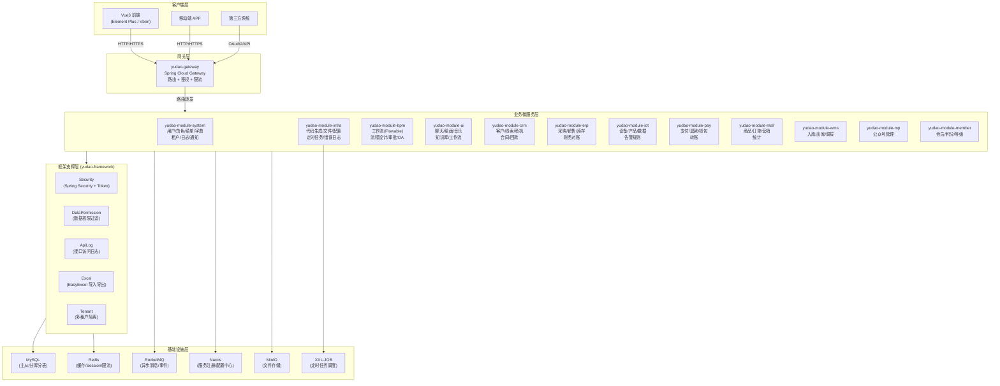
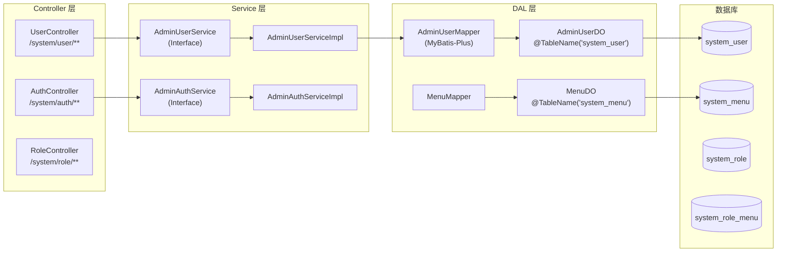
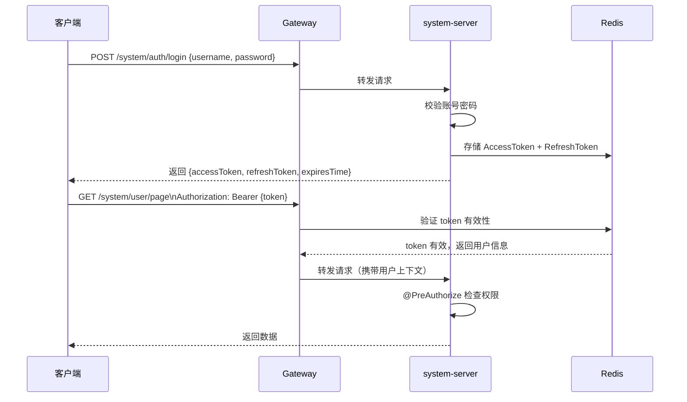

# 01 — 高阶架构（HLA）

## 系统架构总览

---

## 标准分层架构（以 system 模块为例）

---

## 关键设计模式

| 模式 | 实现方式 | 代码示例 |
|------|---------|---------|
| **多租户** | `TenantUtils` + 字段隔离 | 所有表含 `tenant_id` 字段 |
| **数据权限** | `@DataPermission` + 部门树过滤 | `UserController.pageUser()` |
| **接口日志** | `@ApiAccessLog` AOP 拦截 | `@ApiAccessLog(operateType = EXPORT)` |
| **权限控制** | `@PreAuthorize("@ss.hasPermission(...)")` | `system:user:create` |
| **统一响应** | `CommonResult<T>` 包装 | `return success(id)` |
| **全局校验** | `@Validated` + `@Valid` + 自定义 Validator | `UserSaveReqVO` |
| **Excel 导入导出** | `ExcelUtils` + EasyExcel | `UserController.exportUserList()` |
| **OAuth2** | Spring Authorization Server | `/system/auth/login` |
| **工作流** | Flowable + 自定义扩展 | `BpmTaskController` |
| **软删除** | `deleted` 字段 + MyBatis-Plus 插件 | 全局 `LogicDeletePlugin` |

---

## 安全架构

---

## 多租户架构

所有业务表包含 `tenant_id` 字段，框架层自动注入租户过滤条件：

- `TenantUtils.execute()` — 执行跨租户操作
- `TenantLineInnerInterceptor` — MyBatis-Plus 插件自动追加 `tenant_id` WHERE 条件
- 租户隔离粒度：数据行级别（共享数据库）
