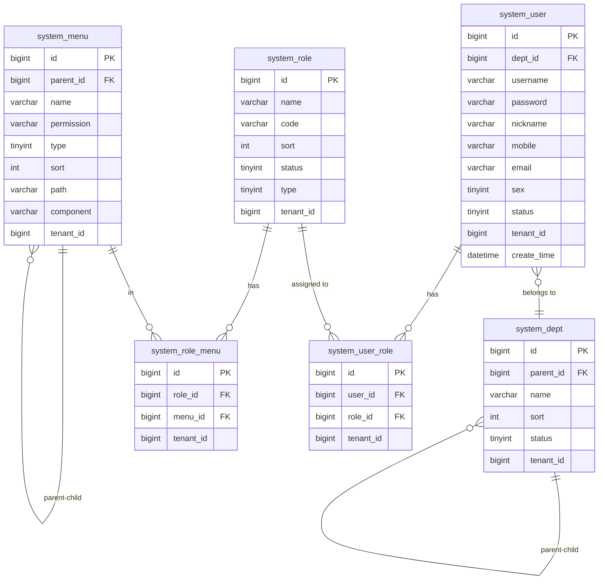
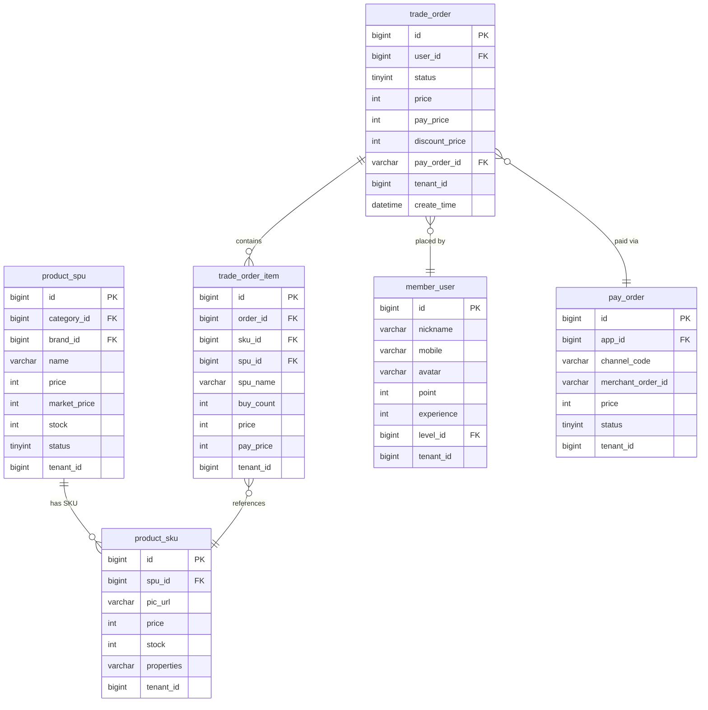

# 07 — 数据库结构

## 说明

yudao-cloud 共有 **367 张数据库表**，按模块前缀分组。所有表均含公共字段：
- `id` BIGINT 主键（自增）
- `creator` / `create_time` — 创建人/时间
- `updater` / `update_time` — 更新人/时间
- `deleted` TINYINT(1) — 逻辑删除（0=未删除, 1=已删除）
- `tenant_id` BIGINT — 租户 ID（多租户隔离）

---

## 表分组统计

| 前缀 | 模块 | 表数量 |
|------|------|--------|
| `system_` | 系统管理 | 30 |
| `infra_` | 基础设施 | 10 |
| `bpm_` | 工作流 | 10 |
| `ai_` | AI | 13 |
| `crm_` | CRM | 22 |
| `erp_` | ERP | 30+ |
| `iot_` | IoT | 15 |
| `pay_` | 支付 | 14 |
| `promotion_` | 营销 | 20+ |
| `product_` | 商品 | 10 |
| `trade_` | 交易 | 15 |
| `member_` | 会员 | 10 |
| `wms_` | 仓储 | 12 |
| `mp_` | 公众号 | 8 |

---

## ER 图 — 系统核心



---

## ER 图 — 商城核心



---

## 关键表结构

### system_user — 系统用户

```sql
CREATE TABLE system_user (
    id              BIGINT          NOT NULL AUTO_INCREMENT COMMENT '用户ID',
    username        VARCHAR(30)     NOT NULL COMMENT '用户账号',
    password        VARCHAR(100)    NOT NULL DEFAULT '' COMMENT '密码（BCrypt）',
    nickname        VARCHAR(30)     NOT NULL COMMENT '用户昵称',
    remark          VARCHAR(500)    COMMENT '备注',
    dept_id         BIGINT          COMMENT '部门ID',
    post_ids        VARCHAR(255)    COMMENT '岗位编号数组',
    email           VARCHAR(50)     COMMENT '邮箱',
    mobile          VARCHAR(11)     COMMENT '手机号',
    sex             TINYINT         DEFAULT 0 COMMENT '性别: 0=未知 1=男 2=女',
    avatar          VARCHAR(512)    COMMENT '头像URL',
    status          TINYINT         NOT NULL DEFAULT 0 COMMENT '状态: 0=启用 1=禁用',
    login_ip        VARCHAR(50)     COMMENT '最后登录IP',
    login_date      DATETIME        COMMENT '最后登录时间',
    creator         VARCHAR(64)     COMMENT '创建者',
    create_time     DATETIME        NOT NULL COMMENT '创建时间',
    updater         VARCHAR(64)     COMMENT '更新者',
    update_time     DATETIME        NOT NULL COMMENT '更新时间',
    deleted         TINYINT(1)      NOT NULL DEFAULT 0 COMMENT '删除标志',
    tenant_id       BIGINT          NOT NULL DEFAULT 0 COMMENT '租户ID',
    PRIMARY KEY (id)
) COMMENT='系统用户表';
```

---

### trade_order — 交易订单

```sql
CREATE TABLE trade_order (
    id                  BIGINT      NOT NULL AUTO_INCREMENT COMMENT '订单ID',
    no                  VARCHAR(64) NOT NULL COMMENT '订单流水号',
    type                TINYINT     NOT NULL COMMENT '订单类型: 1=普通 2=秒杀 3=拼团',
    terminal            TINYINT     NOT NULL COMMENT '终端: 1=H5 2=小程序 3=APP',
    user_id             BIGINT      NOT NULL COMMENT '会员ID',
    user_ip             VARCHAR(50) NOT NULL COMMENT '用户IP',
    user_remark         VARCHAR(255) COMMENT '用户备注',
    status              TINYINT     NOT NULL COMMENT '状态: 0=待付款 10=待发货 20=待收货 30=已完成 40=已取消',
    product_count       INT         NOT NULL COMMENT '商品总数量',
    total_price         INT         NOT NULL COMMENT '商品总价（分）',
    discount_price      INT         NOT NULL DEFAULT 0 COMMENT '优惠金额（分）',
    delivery_price      INT         NOT NULL DEFAULT 0 COMMENT '运费（分）',
    adjust_price        INT         NOT NULL DEFAULT 0 COMMENT '手动调价（分）',
    pay_price           INT         NOT NULL COMMENT '实付金额（分）',
    pay_order_id        BIGINT      COMMENT '支付单ID',
    pay_time            DATETIME    COMMENT '支付时间',
    pay_channel_code    VARCHAR(32) COMMENT '支付渠道',
    delivery_type       TINYINT     COMMENT '配送方式: 1=快递 2=自提',
    delivery_template_id BIGINT     COMMENT '快递模板ID',
    delivery_express_id BIGINT      COMMENT '快递公司ID',
    delivery_express_no VARCHAR(64) COMMENT '快递单号',
    deliver_time        DATETIME    COMMENT '发货时间',
    receive_time        DATETIME    COMMENT '收货时间',
    finish_time         DATETIME    COMMENT '完成时间',
    after_sale_status   TINYINT     COMMENT '售后状态',
    remark              VARCHAR(512) COMMENT '商家备注',
    creator             VARCHAR(64),
    create_time         DATETIME    NOT NULL,
    updater             VARCHAR(64),
    update_time         DATETIME    NOT NULL,
    deleted             TINYINT(1)  NOT NULL DEFAULT 0,
    tenant_id           BIGINT      NOT NULL DEFAULT 0,
    PRIMARY KEY (id)
) COMMENT='交易订单';
```

---

### pay_order — 支付单

```sql
CREATE TABLE pay_order (
    id                  BIGINT      NOT NULL AUTO_INCREMENT COMMENT '支付单ID',
    app_id              BIGINT      NOT NULL COMMENT '应用ID',
    channel_id          BIGINT      COMMENT '支付渠道编号',
    channel_code        VARCHAR(32) COMMENT '支付渠道编码',
    merchant_order_id   VARCHAR(64) NOT NULL COMMENT '商户订单号',
    subject             VARCHAR(255) NOT NULL COMMENT '支付标题',
    body                VARCHAR(255) COMMENT '支付描述',
    notify_url          VARCHAR(1024) COMMENT '回调地址',
    price               INT         NOT NULL COMMENT '支付金额（分）',
    channel_fee_rate    DOUBLE      COMMENT '渠道手续费率',
    channel_fee_price   INT         COMMENT '渠道手续费（分）',
    status              TINYINT     NOT NULL DEFAULT 0 COMMENT '状态: 0=等待 10=成功 20=退款 30=关闭 40=失败',
    user_ip             VARCHAR(50) NOT NULL COMMENT '用户IP',
    expire_time         DATETIME    COMMENT '过期时间',
    success_time        DATETIME    COMMENT '成功时间',
    channel_order_no    VARCHAR(64) COMMENT '渠道订单号',
    no                  VARCHAR(64) COMMENT '支付流水号',
    creator             VARCHAR(64),
    create_time         DATETIME    NOT NULL,
    updater             VARCHAR(64),
    update_time         DATETIME    NOT NULL,
    deleted             TINYINT(1)  NOT NULL DEFAULT 0,
    tenant_id           BIGINT      NOT NULL DEFAULT 0,
    PRIMARY KEY (id)
) COMMENT='支付单';
```

---

### bpm_oa_leave — OA 请假单（工作流示例）

```sql
CREATE TABLE bpm_oa_leave (
    id                  BIGINT      NOT NULL AUTO_INCREMENT,
    user_id             BIGINT      NOT NULL COMMENT '申请人用户ID',
    type                TINYINT     NOT NULL COMMENT '假期类型: 1=事假 2=病假 3=年假',
    reason              VARCHAR(512) NOT NULL COMMENT '请假原因',
    start_time          DATETIME    NOT NULL COMMENT '开始时间',
    end_time            DATETIME    NOT NULL COMMENT '结束时间',
    day                 TINYINT     NOT NULL COMMENT '请假天数',
    result              TINYINT     NOT NULL DEFAULT 0 COMMENT '状态: 0=审批中 1=通过 2=拒绝 3=撤销',
    process_instance_id VARCHAR(64) COMMENT 'Flowable 流程实例ID',
    creator             VARCHAR(64),
    create_time         DATETIME    NOT NULL,
    updater             VARCHAR(64),
    update_time         DATETIME    NOT NULL,
    deleted             TINYINT(1)  NOT NULL DEFAULT 0,
    tenant_id           BIGINT      NOT NULL DEFAULT 0,
    PRIMARY KEY (id)
) COMMENT='OA 请假申请';
```

---

## 数据字典

### 通用状态

| 值 | 说明 |
|----|------|
| `0` | 启用/正常 |
| `1` | 禁用/异常 |

### 订单状态（trade_order.status）

| 值 | 说明 |
|----|------|
| `0` | 待付款 |
| `10` | 待发货 |
| `20` | 待收货 |
| `30` | 已完成 |
| `40` | 已取消 |

### 支付状态（pay_order.status）

| 值 | 说明 |
|----|------|
| `0` | 等待支付 |
| `10` | 支付成功 |
| `20` | 退款中 |
| `30` | 已关闭 |
| `40` | 支付失败 |
