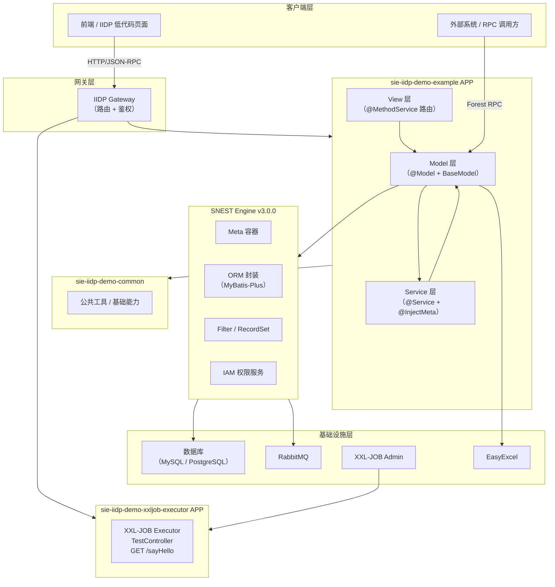
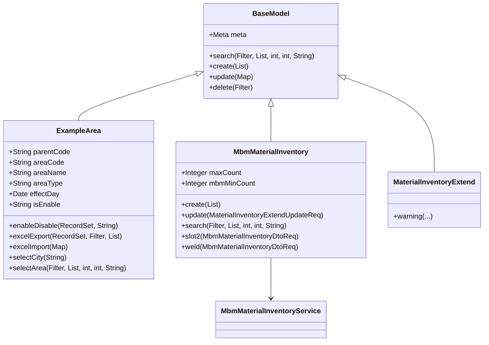

# 01 — 高阶架构（HLA）

## 系统架构总览



## 分层说明

### 1. Model 层（核心）

SNEST 平台以 **`BaseModel`** 为基类，每个业务实体同时承载：
- **数据定义** — `@Property` 注解声明字段、类型、长度、选项
- **业务逻辑** — `@MethodService` 注解方法，平台自动注册为可路由服务
- **数据校验** — `@Validate.*` 注解内嵌字段级校验规则
- **ORM 映射** — `@Model(tableName=...)` 绑定数据库表，平台处理 CRUD

示例模型关系：


### 2. Service 层

业务复杂逻辑抽取到 Service，通过 `@InjectMeta` 注入到 Model：

```
@InjectMeta
MbmMaterialInventoryService service = initService(MbmMaterialInventoryService.class);
```

Service 直接调用底层 `Meta` / `Filter` / `RecordSet` 完成数据操作。

### 3. REST 接口层（XXL-JOB 模块）

```
TestController
  └── GET /sayHello  → "hello, xxljob"（健康检查）
```

### 4. Excel 导入导出

通过 `IExcelExample` 接口标准化导入导出流程，`EasyExcel` 底层处理文件读写。

### 5. 定时任务

XXL-JOB 执行器注册到 XXL-JOB Admin，实现分布式定时任务调度。

## 关键设计模式

| 模式 | 应用场景 |
|------|---------|
| **模型驱动** | `@Model` 注解驱动表结构、API、权限自动生成 |
| **继承扩展（MBM）** | `MbmMaterialInventory extends MaterialInventory`，子类覆盖/扩展父类服务 |
| **插槽机制** | `hiddenApi=true` 的 `@MethodService` 作为可扩展插槽，供二开方注入逻辑 |
| **分片存储** | `@Model(isShard=True, shard=@Shard(...))` 支持按月分表 |
| **软删除** | `isLogicDelete=Bool.True` 字段级逻辑删除 |
| **自动审计** | `isAutoLog=Bool.True` 自动记录创建/更新时间和操作人 |
