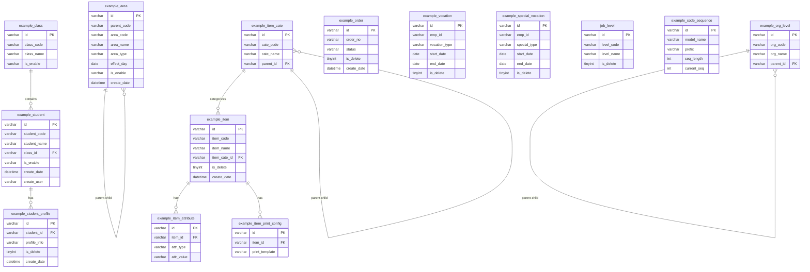

# 07 — 数据库结构

## 说明

SNEST Engine 根据 `@Model` + `@Property` 注解**自动建表**。以下结构来自代码逆向分析。

所有表均包含平台基础字段（由 `BaseModel` 继承）：

| 字段 | 类型 | 说明 |
|------|------|------|
| `id` | `varchar(36)` | 主键，UUID |
| `create_user` | `varchar(100)` | 创建人 |
| `create_date` | `datetime` | 创建时间 |
| `update_user` | `varchar(100)` | 更新人 |
| `update_date` | `datetime` | 更新时间 |
| `is_delete` | `tinyint(1)` | 逻辑删除标志（`isLogicDelete=True` 时有效） |

---

## ER 图



---

## 表结构详情

### example_area — 区域管理

```sql
CREATE TABLE example_area (
    id              VARCHAR(36)     NOT NULL PRIMARY KEY COMMENT '主键',
    parent_code     VARCHAR(60)     COMMENT '父编码',
    area_code       VARCHAR(60)     NOT NULL COMMENT '区域编码',
    area_name       VARCHAR(60)     NOT NULL COMMENT '区域名称',
    area_type       VARCHAR(10)     NOT NULL COMMENT '区域类型: 0=省, 1=市',
    effect_day      DATE            COMMENT '生效日期',
    is_enable       VARCHAR(10)     NOT NULL DEFAULT '0' COMMENT '启用状态: 1=启用, 0=禁用',
    create_user     VARCHAR(100)    COMMENT '创建人',
    create_date     DATETIME        COMMENT '创建时间',
    update_user     VARCHAR(100)    COMMENT '更新人',
    update_date     DATETIME        COMMENT '更新时间'
) ENGINE=InnoDB DEFAULT CHARSET=utf8mb4 COMMENT='区域管理';
```

> 分片配置：按月分表（`create_at:MONTH`，起始分片值 `202212`）

---

### example_student — 学生管理

```sql
CREATE TABLE example_student (
    id              VARCHAR(36)     NOT NULL PRIMARY KEY COMMENT '主键',
    student_code    VARCHAR(60)     COMMENT '学生编码',
    student_name    VARCHAR(60)     NOT NULL COMMENT '学生姓名',
    class_id        VARCHAR(36)     COMMENT '班级ID（关联 example_class.id）',
    is_enable       VARCHAR(10)     COMMENT '启用状态',
    create_user     VARCHAR(100)    COMMENT '创建人',
    create_date     DATETIME        COMMENT '创建时间',
    update_user     VARCHAR(100)    COMMENT '更新人',
    update_date     DATETIME        COMMENT '更新时间'
) ENGINE=InnoDB DEFAULT CHARSET=utf8mb4 COMMENT='学生基本信息';
```

---

### example_class — 班级管理

```sql
CREATE TABLE example_class (
    id          VARCHAR(36)  NOT NULL PRIMARY KEY COMMENT '主键',
    class_code  VARCHAR(60)  COMMENT '班级编码',
    class_name  VARCHAR(60)  NOT NULL COMMENT '班级名称',
    is_enable   VARCHAR(10)  COMMENT '启用状态',
    create_date DATETIME     COMMENT '创建时间',
    create_user VARCHAR(100) COMMENT '创建人',
    update_date DATETIME     COMMENT '更新时间',
    update_user VARCHAR(100) COMMENT '更新人'
) ENGINE=InnoDB DEFAULT CHARSET=utf8mb4 COMMENT='班级信息';
```

---

### example_item — 物料基本资料

```sql
CREATE TABLE example_item (
    id          VARCHAR(36)  NOT NULL PRIMARY KEY COMMENT '主键',
    item_code   VARCHAR(60)  NOT NULL COMMENT '物料编码',
    item_name   VARCHAR(60)  NOT NULL COMMENT '物料名称',
    item_cate_id VARCHAR(36) COMMENT '物料分类ID',
    is_delete   TINYINT(1)   DEFAULT 0 COMMENT '逻辑删除',
    create_date DATETIME     COMMENT '创建时间',
    create_user VARCHAR(100) COMMENT '创建人',
    update_date DATETIME     COMMENT '更新时间',
    update_user VARCHAR(100) COMMENT '更新人'
) ENGINE=InnoDB DEFAULT CHARSET=utf8mb4 COMMENT='物料基本资料';
```

---

### example_vocation — 休假管理

```sql
CREATE TABLE example_vocation (
    id           VARCHAR(36)  NOT NULL PRIMARY KEY COMMENT '主键',
    emp_id       VARCHAR(36)  COMMENT '员工ID',
    vocation_type VARCHAR(20) COMMENT '休假类型',
    start_date   DATE         COMMENT '开始日期',
    end_date     DATE         COMMENT '结束日期',
    is_delete    TINYINT(1)   DEFAULT 0 COMMENT '逻辑删除',
    create_date  DATETIME     COMMENT '创建时间',
    create_user  VARCHAR(100) COMMENT '创建人'
) ENGINE=InnoDB DEFAULT CHARSET=utf8mb4 COMMENT='休假管理';
```

---

### job_level — 职位管理

```sql
CREATE TABLE job_level (
    id          VARCHAR(36)  NOT NULL PRIMARY KEY COMMENT '主键',
    level_code  VARCHAR(60)  COMMENT '职位编码',
    level_name  VARCHAR(60)  NOT NULL COMMENT '职位名称',
    is_delete   TINYINT(1)   DEFAULT 0 COMMENT '逻辑删除',
    create_date DATETIME     COMMENT '创建时间',
    create_user VARCHAR(100) COMMENT '创建人'
) ENGINE=InnoDB DEFAULT CHARSET=utf8mb4 COMMENT='职位管理';
```

---

### example_code_sequence — 编码序列

```sql
CREATE TABLE example_code_sequence (
    id          VARCHAR(36)  NOT NULL PRIMARY KEY COMMENT '主键',
    model_name  VARCHAR(100) NOT NULL COMMENT '模型名称',
    prefix      VARCHAR(20)  COMMENT '编码前缀',
    seq_length  INT          COMMENT '序列号长度',
    current_seq INT          DEFAULT 0 COMMENT '当前序列值',
    create_date DATETIME     COMMENT '创建时间'
) ENGINE=InnoDB DEFAULT CHARSET=utf8mb4 COMMENT='编码序列表';
```

---

## 数据字典

### area_type（区域类型）

| 值 | 标签 |
|----|------|
| `0` | 省 |
| `1` | 市 |

### is_enable（启用状态）

| 值 | 标签 |
|----|------|
| `1` | 启用 |
| `0` | 禁用 |
